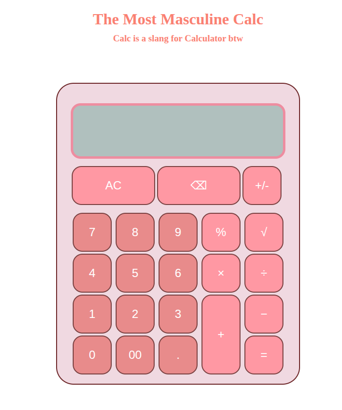

# Calc
End Of Odin's Foundation Course

A simple, fully functional calculator built with HTML, CSS, and JavaScript.

## Description
This is a basic calculator web app that performs standard arithmetic operations: addition, subtraction, multiplication, division, percentage, and root. It features a clean, user-friendly interface and handles decimal numbers properly.

## Screenshot

## Technologies
- HTML
- CSS
- JavaScript

## License
This project is open-source and free to use.